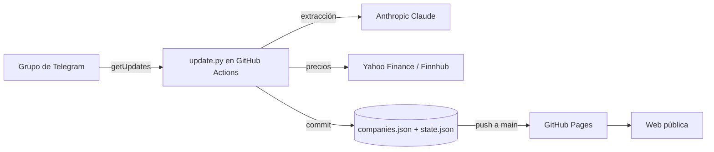

# SOLO INVERSIONES

Seguimiento automático de las empresas cotizadas que se mencionan en un grupo de
Telegram. Cada día, un bot lee los mensajes nuevos, un modelo de lenguaje extrae
las empresas (ticker, mercado, temática y contexto) y el resultado se publica en
una web estática que se redespliega sola.

**Web en vivo:** https://leyremt.github.io/solo-inversiones/

```
Telegram (grupo)  →  GitHub Actions (diario)  →  companies.json  →  GitHub Pages (web pública)
```

## Tabla de contenidos

- [Arquitectura](#arquitectura)
- [Estructura del repositorio](#estructura-del-repositorio)
- [Cómo funciona el pipeline](#cómo-funciona-el-pipeline)
- [Modelo de datos](#modelo-de-datos)
- [Configuración](#configuración)
- [Puesta en marcha](#puesta-en-marcha)
- [Ejecución manual y local](#ejecución-manual-y-local)
- [Frontend](#frontend)
- [Costes](#costes)
- [Seguridad](#seguridad)
- [Limitaciones conocidas](#limitaciones-conocidas)
- [Mantenimiento y troubleshooting](#mantenimiento-y-troubleshooting)
- [Roadmap](#roadmap)

---

## Arquitectura

Tres componentes, sin servidor propio que mantener:

1. **Ingesta** — un bot de Telegram (Bot API) con la privacidad de grupo desactivada,
   de modo que puede leer todos los mensajes del grupo.
2. **Procesamiento** — un script de Python (`update.py`) ejecutado por GitHub Actions
   en un cron diario. Lee los mensajes nuevos, llama a la API de Anthropic (Claude)
   para extraer empresas, **obtiene el precio y la variación de cada una desde Yahoo
   Finance** (con Finnhub de respaldo) y actualiza `companies.json`.
3. **Publicación** — una web estática (`index.html`) servida por **GitHub Pages** desde
   la rama `main`. Lee los precios ya calculados de `companies.json`; cada commit del
   motor la republica automáticamente.



---

## Estructura del repositorio

Disposición **plana**: todos los archivos en la raíz salvo el workflow, que debe vivir
en `.github/workflows/` por requisito de GitHub Actions.

| Archivo | Responsabilidad |
|---|---|
| `index.html` | Frontend. Carga `companies.json` y muestra la lista y los precios (ya calculados por el motor). |
| `companies.json` | Estado de la lista de empresas. Lo lee la web y lo escribe el motor. |
| `state.json` | Offset de Telegram (`getUpdates`) para no reprocesar mensajes. |
| `update.py` | Motor: Telegram → Claude → precios (Yahoo/Finnhub) → merge en `companies.json`. |
| `.github/workflows/daily.yml` | Cron diario (06:00 UTC) + ejecución manual. Ejecuta `update.py` y commitea los cambios. |
| `netlify.toml` | Config heredada de Netlify (GitHub Pages no la usa; se puede borrar). |

---

## Cómo funciona el pipeline

`update.py`, en cada ejecución:

1. **Lee el estado.** Carga `state.json` (`offset`) y `companies.json`.
2. **Descarga mensajes nuevos.** Llama a `GET /bot<token>/getUpdates` con el `offset`
   guardado y `allowed_updates=["message"]`. Filtra por el `chat.id` del grupo y se
   queda solo con los mensajes de texto. Calcula el nuevo `offset` como
   `max(update_id) + 1`.
3. **Extrae empresas con IA.** Construye un prompt con todos los mensajes nuevos y lo
   envía a la API de Anthropic (`/v1/messages`). Pide un array JSON de objetos
   `{name, ticker, exchange, theme, ctx}`, limitando la temática a una lista cerrada.
   El parseo es tolerante: recorta a la sección `[ ... ]`, y si la respuesta llega
   truncada, recupera hasta el último objeto completo.
4. **Mezcla resultados.** Si el ticker ya existe, incrementa `count` y actualiza
   `last_mention`. Si es nuevo, lo añade con `source: "telegram"` y la fecha de hoy.
5. **Obtiene precios.** Para cada empresa pide precio y variación del día a Yahoo Finance
   (`/v8/finance/chart`), probando el símbolo Yahoo (`yh`), el ticker tal cual y, para
   europeas, sufijos de mercado (`.MC`, `.DE`, `.MI`, `.SW`, `.L`…). Si Yahoo falla,
   recurre a Finnhub. Guarda `price`, `change_pct`, `currency` y el símbolo que funcionó.
6. **Persiste.** Reescribe `companies.json` (con `updated` y `price_asof`) y `state.json`
   (con el nuevo `offset`).

El workflow después hace `git add companies.json state.json` y commitea/pushea solo si
hay cambios. El push a `main` republica la web en GitHub Pages.

---

## Modelo de datos

### `companies.json`

```json
{
  "updated": "2026-06-22",
  "price_asof": "2026-06-22 06:05 UTC",
  "companies": {
    "IBE": {
      "ticker": "IBE",
      "exchange": "Madrid",
      "name": "Iberdrola",
      "theme": "Infraestructura",
      "who": "El grupo",
      "ctx": "Motivo breve citado en el chat",
      "first_seen": "2026-06-03",
      "last_mention": "2026-06-22",
      "count": 3,
      "source": "telegram",
      "yh": "IBE.MC",
      "price": 21.69,
      "change_pct": 1.07,
      "currency": "EUR"
    }
  }
}
```

| Campo | Tipo | Notas |
|---|---|---|
| `ticker` | string | Clave del objeto y símbolo bursátil (mayúsculas). |
| `exchange` | string | Mercado (NASDAQ, NYSE, Milán*, SIX*, …). |
| `name` | string | Nombre de la empresa. |
| `theme` | string | Una de las temáticas cerradas (`THEMES` en `update.py`). |
| `who` | string | Anonimizado: siempre `El grupo` (no se guardan nombres de personas). |
| `ctx` | string | Contexto/motivo breve (sin nombres de personas). |
| `first_seen` / `last_mention` | string (YYYY-MM-DD) | Primera y última vez detectada. |
| `count` | number | Número de menciones acumuladas. |
| `source` | string | `whatsapp-seed` (carga inicial) o `telegram` (automáticas). |
| `yh` | string (opcional) | Símbolo en Yahoo Finance usado para el precio (p. ej. `IBE.MC`). |
| `fh` | string (opcional) | Símbolo alternativo para Finnhub (ADR/OTC). |
| `price` / `change_pct` | number \| null | Último precio y variación del día del refresco; `null` si no se pudo obtener. |
| `currency` | string | Divisa del precio (USD, EUR, GBp, CHF…). |

El objeto raíz incluye además `price_asof`: fecha y hora (UTC) del último refresco de precios.

### `state.json`

```json
{ "offset": 847575635 }
```

`offset` es el `update_id` a partir del cual `getUpdates` devuelve mensajes. Avanzarlo
"consume" los mensajes; rebobinarlo permite reprocesarlos (ver troubleshooting).

---

## Configuración

### Secrets (GitHub → Settings → Secrets and variables → Actions)

| Secret | Para qué | Dónde se obtiene |
|---|---|---|
| `TELEGRAM_TOKEN` | Token del bot que lee el grupo | @BotFather |
| `ANTHROPIC_API_KEY` | Extracción de empresas con IA | console.anthropic.com |
| `FINNHUB_KEY` | Respaldo de precios cuando Yahoo no los tiene (opcional) | finnhub.io |

Los precios se obtienen de **Yahoo Finance**, que no necesita clave; Finnhub solo actúa de respaldo.

### Constantes en `update.py`

| Constante | Valor por defecto | Descripción |
|---|---|---|
| `CHAT_ID` | `-1004388607461` | ID del grupo de Telegram. Cámbialo si usas otro grupo. |
| `ANTHROPIC_MODEL` | `claude-haiku-4-5-20251001` | Modelo (configurable por env `ANTHROPIC_MODEL`). |
| `THEMES` | lista de 11 temáticas | Categorías permitidas para clasificar. |

### Cron

En `.github/workflows/daily.yml`, `schedule.cron: "0 6 * * *"` (06:00 UTC).
Edita esa línea para cambiar la hora. Para mayor fiabilidad conviene un minuto poco
concurrido (los cron "en punto" se retrasan más).

---

## Puesta en marcha

1. **Crear el bot.** En @BotFather: `/newbot`. Desactivar `/setprivacy` (Disable) para
   que lea todos los mensajes. Añadir el bot al grupo (si ya estaba, quitarlo y volver
   a añadirlo para que aplique el cambio de privacidad).
2. **Obtener el `CHAT_ID`.** Abrir `https://api.telegram.org/bot<token>/getUpdates`
   tras escribir un mensaje en el grupo; el `chat.id` (negativo) es el del grupo.
   Ponerlo en `CHAT_ID` dentro de `update.py`.
3. **Subir el repo** a GitHub.
4. **Crear los tres secrets** (tabla de arriba).
5. **Activar GitHub Pages**: con el repo **público** → Settings → Pages → *Deploy from a
   branch* → `main` / `/ (root)`. La web queda en `https://<usuario>.github.io/<repo>/`.
6. **Lanzar el workflow una vez** (Actions → Run workflow) para que el motor rellene los
   precios iniciales en `companies.json`.

---

## Ejecución manual y local

**Manual (recomendado para probar):** pestaña *Actions* → *Actualizar empresas (diario)*
→ *Run workflow*. El log muestra cuántos mensajes ha leído y qué empresas ha añadido.

**Local:**

```bash
export TELEGRAM_TOKEN=...        # token del bot
export ANTHROPIC_API_KEY=...     # key de Anthropic
export FINNHUB_KEY=...           # opcional: valida tickers
python3 update.py
```

Solo usa la librería estándar de Python (no hay dependencias que instalar). Escribe los
cambios en `companies.json` y `state.json` del directorio actual.

---

## Frontend

`index.html` es una única página estática, sin framework ni build:

- Al cargar, hace `fetch('companies.json')` (con *cache-busting*) y pinta una tarjeta
  por empresa, con filtros por temática y buscador.
- Muestra `price` y `change_pct` directamente desde `companies.json` (ya calculados por
  el motor), con el símbolo de divisa según `currency`. No hace llamadas a APIs externas
  ni lleva claves embebidas.
- La cabecera muestra la fecha del último refresco de precios (`price_asof`).

---

## Costes

| Servicio | Uso | Coste |
|---|---|---|
| GitHub Actions | Cron diario | Gratis (límites de cuenta personal) |
| GitHub Pages | Hosting + auto-deploy | Gratis (repo público) |
| Telegram Bot API | Lectura del grupo | Gratis |
| Yahoo Finance | Precios y variación diaria | Gratis (sin clave) |
| Finnhub | Respaldo de precios | Gratis (plan free) |
| Anthropic (Claude) | Extracción diaria | ~0,30–0,60 €/mes según volumen |

---

## Seguridad

- `TELEGRAM_TOKEN` y `ANTHROPIC_API_KEY` viven **solo** en GitHub Secrets y se inyectan
  como variables de entorno en el job. No deben aparecer en el código ni en el frontend.
- El frontend **no lleva ninguna clave**: los precios ya vienen calculados en
  `companies.json`. La `FINNHUB_KEY` (respaldo) vive solo en GitHub Secrets.
- El repositorio es **público** (requisito de GitHub Pages gratis). La web muestra datos
  **anonimizados**: el campo `who` es siempre `El grupo` y no se guardan nombres de personas.
- Rotación: el token del bot se regenera en @BotFather (`/revoke`); las API keys, en sus
  respectivos paneles.

---

## Limitaciones conocidas

- **El bot solo ve mensajes desde que entra** al grupo (la Bot API no da histórico). La
  carga inicial de empresas se sembró aparte (`source: "whatsapp-seed"`).
- **Retención de Telegram (~24 h):** los mensajes pendientes para el bot caducan, por eso
  el motor debe correr al menos una vez al día.
- **Cron de GitHub no es exacto:** las tareas programadas pueden retrasarse o saltarse,
  sobre todo a horas en punto. Si falta una ejecución, lanzarla a mano.
- **Precios diarios, no intradía:** se calculan en el refresco diario; no cambian al
  abrir la página. Yahoo Finance es una fuente no oficial y puede cambiar sin aviso.
- **Símbolos mal extraídos:** si la IA devuelve un ticker incorrecto, el precio sale
  "sin datos" hasta corregir el campo `yh` de esa empresa.

---

## Mantenimiento y troubleshooting

- **Forzar una actualización:** *Actions → Run workflow*.
- **Reprocesar mensajes ya consumidos:** poner en `state.json` el `offset` anterior y
  relanzar el workflow. (Útil si una ejecución leyó mensajes pero falló la extracción.)
- **Empezar la ingesta de cero:** `state.json` → `{"offset": 0}`.
- **Cambiar de grupo:** actualizar `CHAT_ID` en `update.py`.
- **La extracción falla con lotes grandes:** el parseo ya recorta y recupera arrays
  truncados; si aún así falla, el log imprime la respuesta cruda de la API para depurar.
- **Cambiar el modelo:** variable de entorno `ANTHROPIC_MODEL` (o editar la constante).

---

## Roadmap

- **Más contexto por empresa:** además del nombre, capturar opinión (alcista/bajista),
  precio objetivo, motivo y horizonte mencionados en el chat.
- **Histórico de menciones:** evolución de `count`/`last_mention` y cuándo se habló de
  cada valor, para destacar las más comentadas.
- **Catalizadores con IA:** eventos próximos (resultados, lanzamientos, regulación) que
  podrían mover cada empresa.
