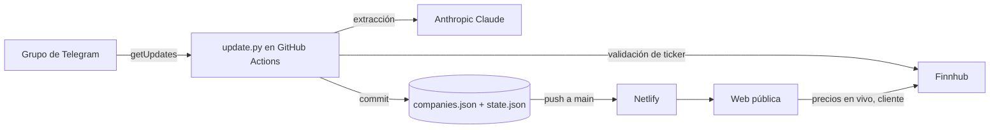

# SOLO INVERSIONES

Seguimiento automático de las empresas cotizadas que se mencionan en un grupo de
Telegram. Cada día, un bot lee los mensajes nuevos, un modelo de lenguaje extrae
las empresas (ticker, mercado, temática y contexto) y el resultado se publica en
una web estática que se redespliega sola.

```
Telegram (grupo)  →  GitHub Actions (diario)  →  companies.json  →  Netlify (web pública)
```

## Tabla de contenidos

- [Arquitectura](#arquitectura)
- [Estructura del repositorio](#estructura-del-repositorio)
- [Cómo funciona el pipeline](#cómo-funciona-el-pipeline)
- [Modelo de datos](#modelo-de-datos)
- [Configuración](#configuración)
- [Puesta en marcha](#puesta-en-marcha)
- [Ejecución manual y local](#ejecución-manual-y-local)
- [Frontend](#frontend)
- [Costes](#costes)
- [Seguridad](#seguridad)
- [Limitaciones conocidas](#limitaciones-conocidas)
- [Mantenimiento y troubleshooting](#mantenimiento-y-troubleshooting)
- [Roadmap](#roadmap)

---

## Arquitectura

Tres componentes, sin servidor propio que mantener:

1. **Ingesta** — un bot de Telegram (Bot API) con la privacidad de grupo desactivada,
   de modo que puede leer todos los mensajes del grupo.
2. **Procesamiento** — un script de Python (`update.py`) ejecutado por GitHub Actions
   en un cron diario. Lee los mensajes nuevos, llama a la API de Anthropic (Claude)
   para extraer empresas, valida los tickers contra Finnhub y actualiza `companies.json`.
3. **Publicación** — una web estática (`index.html`) alojada en Netlify, conectada al
   repositorio. Cada commit del motor dispara un redespliegue automático.



---

## Estructura del repositorio

Disposición **plana**: todos los archivos en la raíz salvo el workflow, que debe vivir
en `.github/workflows/` por requisito de GitHub Actions.

| Archivo | Responsabilidad |
|---|---|
| `index.html` | Frontend. Carga `companies.json` y pide los precios en vivo a Finnhub desde el navegador. |
| `companies.json` | Estado de la lista de empresas. Lo lee la web y lo escribe el motor. |
| `state.json` | Offset de Telegram (`getUpdates`) para no reprocesar mensajes. |
| `update.py` | Motor: Telegram → Claude → Finnhub → merge en `companies.json`. |
| `.github/workflows/daily.yml` | Cron diario (06:00 UTC) + ejecución manual. Ejecuta `update.py` y commitea los cambios. |
| `netlify.toml` | Configuración de Netlify: publica la raíz, sin paso de build. |

---

## Cómo funciona el pipeline

`update.py`, en cada ejecución:

1. **Lee el estado.** Carga `state.json` (`offset`) y `companies.json`.
2. **Descarga mensajes nuevos.** Llama a `GET /bot<token>/getUpdates` con el `offset`
   guardado y `allowed_updates=["message"]`. Filtra por el `chat.id` del grupo y se
   queda solo con los mensajes de texto. Calcula el nuevo `offset` como
   `max(update_id) + 1`.
3. **Extrae empresas con IA.** Construye un prompt con todos los mensajes nuevos y lo
   envía a la API de Anthropic (`/v1/messages`). Pide un array JSON de objetos
   `{name, ticker, exchange, theme, ctx}`, limitando la temática a una lista cerrada.
   El parseo es tolerante: recorta a la sección `[ ... ]`, y si la respuesta llega
   truncada, recupera hasta el último objeto completo.
4. **Valida los tickers.** Para cada ticker consulta `GET /quote` de Finnhub; lo acepta
   si devuelve un precio `> 0`. Si no hay `FINNHUB_KEY`, o la llamada falla, no se
   descarta (criterio permisivo, ver [Limitaciones](#limitaciones-conocidas)).
5. **Mezcla resultados.** Si el ticker ya existe, incrementa `count` y actualiza
   `last_mention`. Si es nuevo, lo añade con `source: "telegram"` y la fecha de hoy.
6. **Persiste.** Reescribe `companies.json` (con `updated` = hoy) y `state.json`
   (con el nuevo `offset`).

El workflow después hace `git add companies.json state.json` y commitea/pushea solo si
hay cambios. El push a `main` dispara el redespliegue en Netlify.

---

## Modelo de datos

### `companies.json`

```json
{
  "updated": "2026-06-22",
  "companies": {
    "NVDA": {
      "ticker": "NVDA",
      "exchange": "NASDAQ",
      "name": "NVIDIA",
      "theme": "IA / Semis",
      "who": "grupo (Telegram)",
      "ctx": "Motivo breve citado en el chat",
      "first_seen": "2026-06-03",
      "last_mention": "2026-06-22",
      "count": 3,
      "source": "telegram",
      "fh": "PRYMY"
    }
  }
}
```

| Campo | Tipo | Notas |
|---|---|---|
| `ticker` | string | Clave del objeto y símbolo bursátil (mayúsculas). |
| `exchange` | string | Mercado (NASDAQ, NYSE, Milán*, SIX*, …). |
| `name` | string | Nombre de la empresa. |
| `theme` | string | Una de las temáticas cerradas (`THEMES` en `update.py`). |
| `who` | string | Quién la mencionó (`grupo (Telegram)` para las automáticas). |
| `ctx` | string | Contexto/motivo breve. |
| `first_seen` / `last_mention` | string (YYYY-MM-DD) | Primera y última vez detectada. |
| `count` | number | Número de menciones acumuladas. |
| `source` | string | `whatsapp-seed` (carga inicial) o `telegram` (automáticas). |
| `fh` | string (opcional) | Símbolo alternativo para Finnhub (ADR/OTC) cuando el principal no cotiza en EE. UU. |

### `state.json`

```json
{ "offset": 847575635 }
```

`offset` es el `update_id` a partir del cual `getUpdates` devuelve mensajes. Avanzarlo
"consume" los mensajes; rebobinarlo permite reprocesarlos (ver troubleshooting).

---

## Configuración

### Secrets (GitHub → Settings → Secrets and variables → Actions)

| Secret | Para qué | Dónde se obtiene |
|---|---|---|
| `TELEGRAM_TOKEN` | Token del bot que lee el grupo | @BotFather |
| `ANTHROPIC_API_KEY` | Extracción de empresas con IA | console.anthropic.com |
| `FINNHUB_KEY` | Validación de tickers (servidor) y precios (cliente) | finnhub.io |

### Constantes en `update.py`

| Constante | Valor por defecto | Descripción |
|---|---|---|
| `CHAT_ID` | `-1004388607461` | ID del grupo de Telegram. Cámbialo si usas otro grupo. |
| `ANTHROPIC_MODEL` | `claude-haiku-4-5-20251001` | Modelo (configurable por env `ANTHROPIC_MODEL`). |
| `THEMES` | lista de 11 temáticas | Categorías permitidas para clasificar. |

### Cron

En `.github/workflows/daily.yml`, `schedule.cron: "0 6 * * *"` (06:00 UTC).
Edita esa línea para cambiar la hora. Para mayor fiabilidad conviene un minuto poco
concurrido (los cron "en punto" se retrasan más).

---

## Puesta en marcha

1. **Crear el bot.** En @BotFather: `/newbot`. Desactivar `/setprivacy` (Disable) para
   que lea todos los mensajes. Añadir el bot al grupo (si ya estaba, quitarlo y volver
   a añadirlo para que aplique el cambio de privacidad).
2. **Obtener el `CHAT_ID`.** Abrir `https://api.telegram.org/bot<token>/getUpdates`
   tras escribir un mensaje en el grupo; el `chat.id` (negativo) es el del grupo.
   Ponerlo en `CHAT_ID` dentro de `update.py`.
3. **Subir el repo** a GitHub.
4. **Crear los tres secrets** (tabla de arriba).
5. **Conectar Netlify**: Add new project → Import from GitHub → elegir el repo.
   Build command vacío, publish directory `.`. Deploy.
6. **Insertar la `FINNHUB_KEY` del frontend** en `index.html` (constante
   `FINNHUB_KEY`), ya que los precios se piden desde el navegador.

---

## Ejecución manual y local

**Manual (recomendado para probar):** pestaña *Actions* → *Actualizar empresas (diario)*
→ *Run workflow*. El log muestra cuántos mensajes ha leído y qué empresas ha añadido.

**Local:**

```bash
export TELEGRAM_TOKEN=...        # token del bot
export ANTHROPIC_API_KEY=...     # key de Anthropic
export FINNHUB_KEY=...           # opcional: valida tickers
python3 update.py
```

Solo usa la librería estándar de Python (no hay dependencias que instalar). Escribe los
cambios en `companies.json` y `state.json` del directorio actual.

---

## Frontend

`index.html` es una única página estática, sin framework ni build:

- Al cargar, hace `fetch('companies.json')` (con *cache-busting*) y pinta una tarjeta
  por empresa, con filtros por temática y buscador.
- Para cada empresa pide el precio y la variación del día a Finnhub
  (`/quote`), usando `fh` si existe o el `ticker` en caso contrario.
- La `FINNHUB_KEY` del frontend va embebida en el archivo: es una clave de solo lectura
  de cotizaciones, pensada para uso en cliente.

---

## Costes

| Servicio | Uso | Coste |
|---|---|---|
| GitHub Actions | Cron diario | Gratis (límites de cuenta personal) |
| Netlify | Hosting + auto-deploy | Gratis (plan Starter) |
| Telegram Bot API | Lectura del grupo | Gratis |
| Finnhub | Precios + validación | Gratis (plan free, 60 req/min) |
| Anthropic (Claude) | Extracción diaria | ~0,30–0,60 €/mes según volumen |

---

## Seguridad

- `TELEGRAM_TOKEN` y `ANTHROPIC_API_KEY` viven **solo** en GitHub Secrets y se inyectan
  como variables de entorno en el job. No deben aparecer en el código ni en el frontend.
- La `FINNHUB_KEY` **sí** está en `index.html` porque los precios se consultan desde el
  navegador. Es una clave de cotizaciones; si se agota el límite, se regenera en Finnhub.
- El repositorio puede ser privado; la web publicada por Netlify es pública.
- Rotación: el token del bot se regenera en @BotFather (`/revoke`); las API keys, en sus
  respectivos paneles.

---

## Limitaciones conocidas

- **El bot solo ve mensajes desde que entra** al grupo (la Bot API no da histórico). La
  carga inicial de empresas se sembró aparte (`source: "whatsapp-seed"`).
- **Retención de Telegram (~24 h):** los mensajes pendientes para el bot caducan, por eso
  el motor debe correr al menos una vez al día.
- **Cron de GitHub no es exacto:** las tareas programadas pueden retrasarse o saltarse,
  sobre todo a horas en punto. Si falta una ejecución, lanzarla a mano.
- **Cobertura de Finnhub (plan free):** muchos valores europeos/OTC no devuelven precio
  (aparecen como "sin datos"); por eso la validación es permisiva y algún ticker puede
  ser impreciso.
- **Límite de 60 req/min de Finnhub:** con muchas empresas, la carga simultánea de
  precios en el frontend puede dejar algunos en blanco hasta recargar.

---

## Mantenimiento y troubleshooting

- **Forzar una actualización:** *Actions → Run workflow*.
- **Reprocesar mensajes ya consumidos:** poner en `state.json` el `offset` anterior y
  relanzar el workflow. (Útil si una ejecución leyó mensajes pero falló la extracción.)
- **Empezar la ingesta de cero:** `state.json` → `{"offset": 0}`.
- **Cambiar de grupo:** actualizar `CHAT_ID` en `update.py`.
- **La extracción falla con lotes grandes:** el parseo ya recorta y recupera arrays
  truncados; si aún así falla, el log imprime la respuesta cruda de la API para depurar.
- **Cambiar el modelo:** variable de entorno `ANTHROPIC_MODEL` (o editar la constante).

---

## Roadmap

- **Más contexto por empresa:** además del nombre, capturar opinión (alcista/bajista),
  precio objetivo, motivo y horizonte mencionados en el chat.
- **Histórico de menciones:** evolución de `count`/`last_mention` y cuándo se habló de
  cada valor, para destacar las más comentadas.
- **Catalizadores con IA:** eventos próximos (resultados, lanzamientos, regulación) que
  podrían mover cada empresa.
